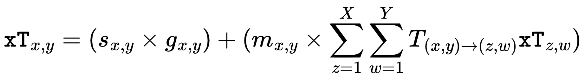

# Expected threat (xT) model based on Wyscout data
This repo contains Python modules for implementing an interpretation of the Expected Threat (xT) model as described by [Karun Sing (2018)](https://karun.in/blog/expected-threat.html) and are designed to be used on Wyscout data.

Except for just implementing a working code for creating and running the models, emphasis has been put on making the application "modular" by breaking down the xT formula's subcomponents as separate functions in a way which enables better readability (e.g clearer representation of the xT formula in the code), changeability (e.g model parameter configuration), usability (e.g produce other models like xG, move prob etc) and analyzeability (e.g see the underlying calculations and values of the model outputs).

This project has been implemented for learning purposes and as a first step for me to engage and contribute to the Football analytics community. I'm open to any feedback on this implementation!

## Model details
The xT model is computed in the form of a grid with X*Y cells representing the football pitch where each event feeding the model occurs at a position (x,y) on the grid.

The xT value for each cell is computed according to the following formula:

For a detailed explanation of the applied xT model please read the blog post by [Karun Sing (2018)](https://karun.in/blog/expected-threat.html).

## Data sets
Wyscout event data from 2017/2018 major leagues and Fifa World Cup 2018 made available through the research of [Pappalardo et al., (2019)](https://doi.org/10.6084/m9.figshare.c.4415000.v5).

The Wyscout pitch event coordinate system:

## Running the project
1. Download the following data sets from [this site](https://figshare.com/collections/Soccer_match_event_dataset/4415000/5):
    - events
    - matches
    - players
    - teams
2. Place the data files (jsons) in a new folder named `wyscoutdata` on the same level as the root folder (`wyscout-xt-model`) as indicated by the `load_*_data()` functions in the `wyscoutmodelutlity.py` module, or just change to any other path that you prefer.
3. Run the entire `modelcreator.py` to produce all the script outputs or run individual sections (cells) of the script to produce specific outputs.
4. Play around by changing different model parameter values (UPPERCASE_VARIABLES) in the code.

## Results

Example model trained on events from England's Premier League season 2017/2018:

For more plots like *shots prob*, *move prob*, *transition prob* or *goal prob (xG)* grid which are all integral parts of the xT model please see the `plots` folder.

## References
- Pappalardo, Luca; Massucco, Emanuele (2019): Soccer match event dataset. figshare. Collection. https://doi.org/10.6084/m9.figshare.c.4415000.v5
- Karun Sing (2018): Introducing Expected Threat (xT). https://karun.in/blog/expected-threat.html
